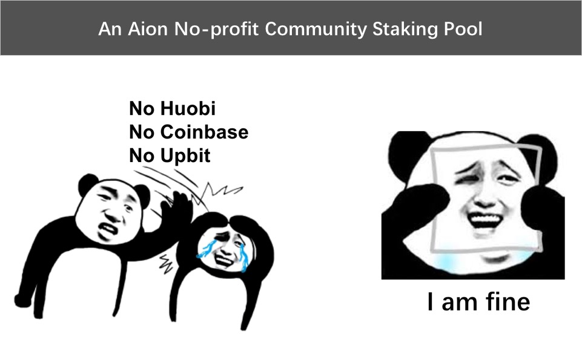

---
# You don't need to edit this file, it's empty on purpose.
# Edit theme's home layout instead if you wanna make some changes
# See: https://jekyllrb.com/docs/themes/#overriding-theme-defaults
layout: page
---


```bash
0x01 This staking pool is non-profit, 2% fee is charged to cover basic power cost.
0x02 Although fee is lower than most pools, the performance is as good as top pools.
0x03 When huobi? When coinbase? Just a joke, I love Aion.
0x04 I operate this pool to secure Aion network.
0x05 Also, I operate this pool to prove that POS can be done on a resource limited device with excellent performance. 
```

